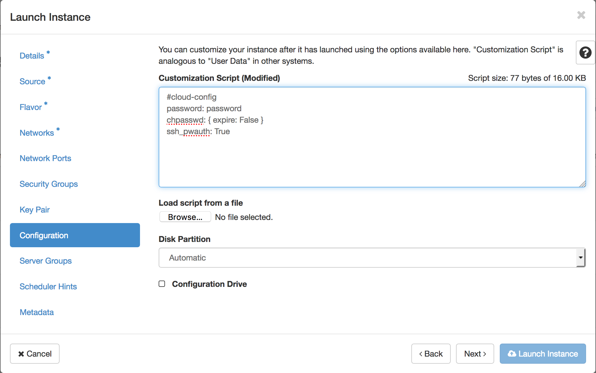

1、使用jenkin构建vio的时候配置文件选择vio-dvs.json

2、登录到构建好的vio的loadbalancer节点创建虚机（需要创建key），在compute节点和controller节点上创建会连不到创建的虚机上，网络选择默认的
flat-tempest，在computenode1上创建之后在computenode2同样创建一台（使用availability-zone），创建之后使用ssh登录到虚机上（使用key）
ping对方虚机以确定当前网络模式下虚机是否互通

3、登录到controller01节点上。切换成ml2 core plugin，neutron server启动失败，看log里面有fernet相关信息，报参数不够。neutron ml2启动
的时候会建立到nova的连接，需要进程启动用户的key，用来解析配置文件中的password，但是vio之前没有这个需求（因为不是ml2 core plugin）。这里
可以执行下面操作，从现有key中拷贝一个给root用户，因为是用root用户启动的进程。
```
cd /etc/fernet
cp nova.key root.key
```

4、拷贝文件https://github.com/huihongxiao/vmware-nsx/blob/master/vmware_nsx/plugins/ml2/vds_mech_driver.py
至vmware_nsx/plugins下。

5、修改neutron.conf配置文件，将core plugin改为ml2, 之后重启neutron-server服务

6、为vds mech driver添加entry point
/usr/lib/python2.7/dist-packages/vmware_nsx-10.0.0.6420508.egg-info/entry_points.txt
```
[neutron.ml2.mechanism_drivers]
vds = vmware_nsx.plugins.vds_mech_driver:VDSMechDriver
```

7、为了能创建vxlan network，在tenant_network_types添加vxlan；将vds加入到 neutron conf下的[ml2]的mechanism_drivers
中；然后配置vlan的network_vlan_ranges.综上，在neutron conf后面添加：
```
[ml2]
tenant_network_types = vxlan, vlan
mechanism_drivers = vds

[ml2_type_vxlan]
vni_ranges = 1:1000

[ml2_type_vlan]
network_vlan_ranges = physical_net:1:1000
```

 8、回到loadbalancer01，创建网络neutron net-create, 之后在该网络中创建子网neutron subnet-create，之后使用新的网络
 分别在两个cluster上创建虚机，失败，提示端口绑定错误，另vds_mech_driver.py在进程启动时没有创建pyc文件。后在singleVM环
 境中重做实验，可以创建虚机，但是ping不通，依旧是网络问题，neutron日志报vds_mech_driver.py代码问题。

9、在更换到15环境后，因为nsx的虚机默认在虚拟网络，外部无法直接ping通，访问虚拟机的话需要建立公网、私网、公网私网之间的路由：
1）公网：相当于外部网络，在填写完网络名称之后需要为其添加子网，之后的虚机将使用该子网，子网网段选择需要是VIO部署的时候为虚机
分配的网段（网段内IP充足），之后要在网络设置中将这个网络设置为外部（external）和共享（shared），DNS与网关的设置均与VIO相
同即可。
2）私网：相当于内部网络，创建的虚机将直接使用，子网网段设置为192.168.0.2-192.168.0.254，之后要在网络设置中将这个网络设置
为共享，这样各个虚拟机在内部便可以直接通信。
3）网络路由：是连接公网和私网的路由。外部网关对应外网IP，内部接口对应内网IP。可在网络拓扑（network topology）中查看网络路
由的对应情况。
4）floatingIP：floatingIP相当于为虚机提供一个外部访问的地址，与公网直接相连。首先要为其分配一个IP，该IP依旧会从公网的IP
段中获取，之后将该IP绑定之公网网络之上，完成之后便可以用SSH等来通过floatingIP来访问该虚机

10、在建好虚拟机之后还需要给虚拟机分配一个floatingIP才能在外网访问。即便使用正确的key建立虚拟机也无法直接访问，需要在建立虚机时，
在configuration中添加下面一段代码：
```
#cloud-config
password: password
chpasswd: { expire: False }
ssh_pwauth: True
```

通过这段代码建立虚机之后可用密码password登录。目前测试均能通过
