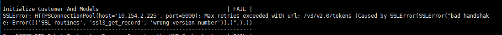
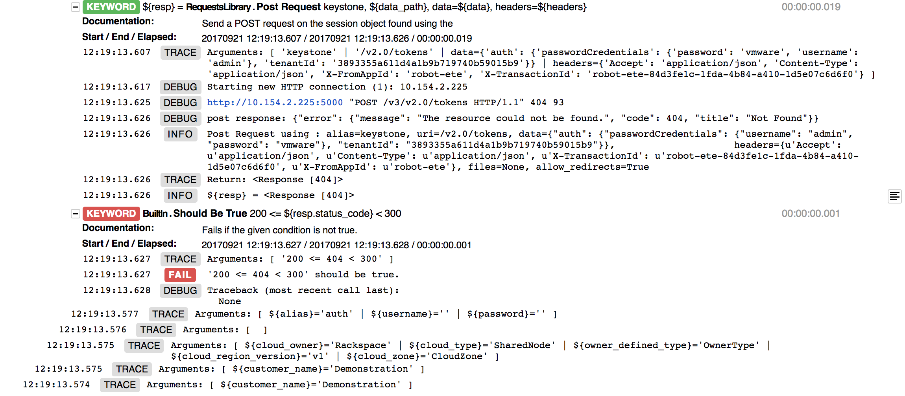
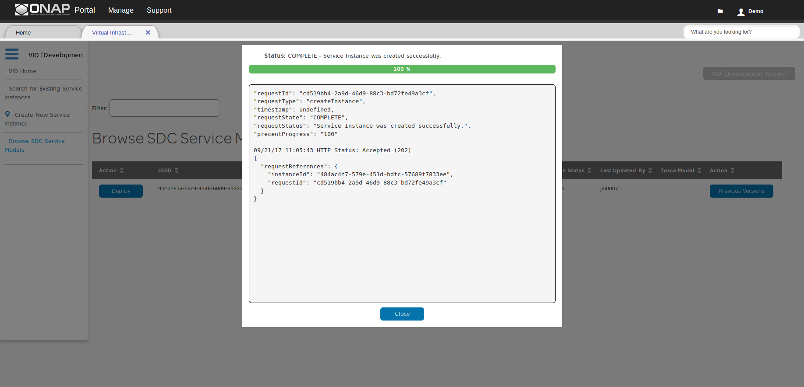
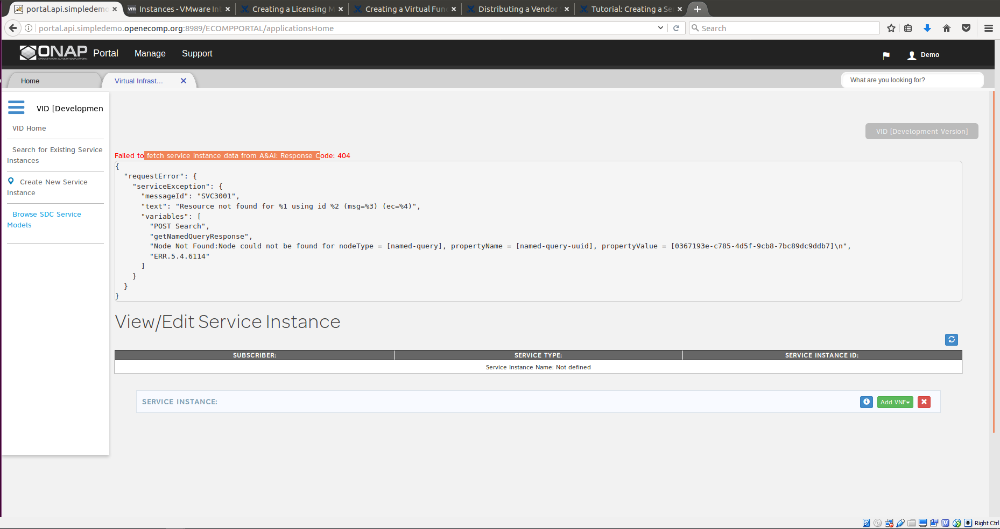
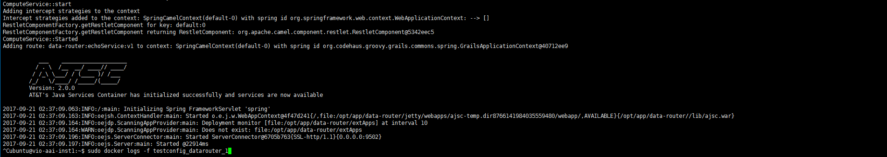
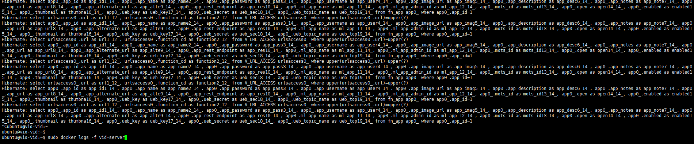
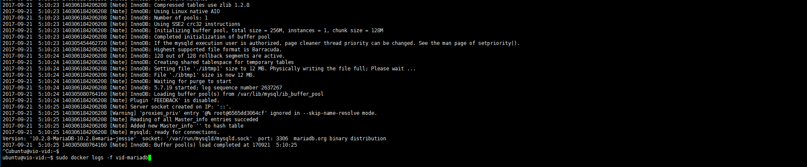
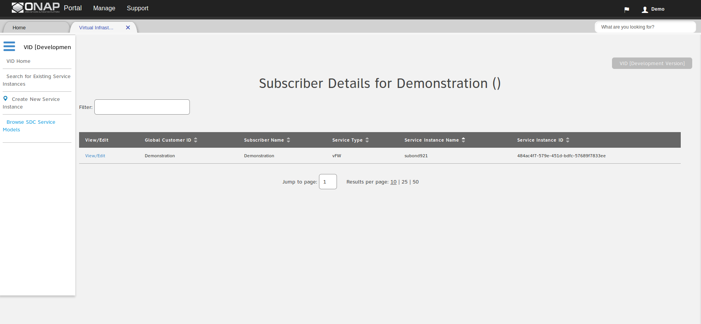

## TroubleShooting Guide

Content

  * [sdc服务不可用](#sdc服务不可用)
  * [robot中的ssl问题](#robot中的ssl问题)
  * [aai-inst1的resource问题](#aai-inst1的resource问题)
  * [demo init failure in robot](#demo_init_failure)
  * [vid_fetch_service_data_failure](#vid_failed_to_fetch_service_instance_data_form_aai_response_code_404)
  * [dcae_docker_run_boot_container_failure](#dcae_boot_failure)

### sdc服务不可用

  错误现象：

  

  排查方法：

  第一步：进入SDC所在的主机，查看各CONTAINER是否正常；  
  第二步：利用SDC自身脚本检查SDC中各服务的异常情况；  
  第三步：对SDC中有问题的服务进行单独log检查。

  具体参考如下：

  ```
  # 进入SDC所在的主机，Ip地址为10.154.9.75
  $ ssh -i onap_rsa ubuntu@10.154.9.75

  # 查看CONTAINER情况
  $ sudo docker ps -a

  # SDC自身检查脚本 /data/scripts/docker_health.sh
  $ ./docker_health.sh
  # 亦可直接调用health检查方法
  # http://localhost:8181/sdc1/rest/healthCheck
  # http://localhost:8080/sdc2/rest/healthCheck
  $ curl http://localhost:8181/sdc1/rest/healthCheck
  $ curl http://localhost:8080/sdc2/rest/healthCheck

  # 对SDC中各服务(BE, ES, FE等)进行单独排查
  # 其log文件位于 /data/logs/
  # BE的错误日志 /data/logs/BE/SDC/SDC-BE/error.log
  $ cat error.log
  2017-08-29T02:05:36.661Z|||||ES-Health-Check-Thread|||SDC-BE||||||||ERROR||||192.168.15.35||o.o.sdc.be.dao.impl.ESCatalogDAO||ActivityType=<?>, Desc=<Error while trying to connect to elasticsearch. host: [10.154.9.75:9300] | port: 9200 | error: None of the configured nodes are available: [{#transport#-1}{10.154.9.75}{10.154.9.75:9300}]>org.elasticsearch.client.transport.NoNodeAvailableException: None of the configured nodes are available: [{#transport#-1}{10.154.9.75}{10.154.9.75:9300}]
  ```

  错误原因：

  BE不能连接至ES，进一步原因是VIO中不支持VM访问自身的FloatingIp。

  解决办法：清除SDC VM中的FloatingIp信息，然后重启服务。

  具体参考如下：

  ```
  # SDC VM中FloatingIp的信息的位置 /opt/config/public_ip.txt
  $ cd /opt/config/
  $ mv public_ip.txt public_ip.txt.break

  # SDC中各服务通过挂载VOLUME的方式进行工作，因此，重启服务前需注释掉sfdisk相关代码，并清除相关数据
  # sfdisk相关代码位置 文件/opt/asdc_install.sh中84-88行(基于ONAP 2017-8-25 master分支源码)
  # 相关代码如下
  # 84 # sfdisk /dev/$DISK < /opt/asdc_ext_volume_partitions.txt
  # 85 # mkfs -t ext4 /dev/$DISK"1"
  # 86 # mkdir -p /data
  # 87 # mount /dev/$DISK"1" /data
  # 88 # echo "/dev/"$DISK"1  /data           ext4    errors=remount-ro,noatime,barrier=0 0       1" >> /etc/fstab

  # 清空相关数据，位置/data/
  $ rm -rf /data/*

  # 删除所有的CONTAINER，并重启服务，即重新运行脚本/opt/asdc_install.sh
  $ sudo docker rm $(sudo docker ps -a -q)
  $ cd /opt/
  $ sudo ./asdc_install.sh
  ```

### robot中的ssl问题

  错误现象

  在robot VM中执行检查(例如 `./demo.sh init`和`./ete.sh health`)时，container出现ssl认证失败。

  

  原因分析

  VIO环境中使用的时HTTPS协议，需要SSL的私钥认证，而robot中的container中没有相关私钥信息，导致认证失败。

  解决办法

  取消VIO中环境中的SSL认证过程。需要注意的是，VIO中SSL的认证过程由haproxy负责，OpenStack相关的配置，一般为默认选项。

  主要步骤如下：

  第一步：修改haproxy相关配置(包括haproxy.cfg, keystone-proxy.conf, keystone.conf)，并重启服务。
  第二步：修改OpenStack endpoint相关信息。
  第三步：修改robot中的配置信息，并重新启动服务。

  参考过程如下：

  第一步：修改haproxy相关配置，并重启服务。需要注意的是，VIO环境中Keystone相关服务配置在apache2上，随apache2一起启动。因此，apache2中关于keystone的配置也要相关的进行修改。

  ```
  # haproxy的配置文件 /etc/haproxy/haproxy.cfy
  # 将相应的listen下bing项中删除ssl相关信息

  # 修改前
  #  38 listen keystone-public
  #  39  bind 10.154.2.225:5000 ssl crt /etc/ssl/vio.pem
  #  40  balance roundrobin
  #  41  option http-server-close
  #  42  option httplog
  #  43  option forwardfor
  #  44  fullconn 1024
  #  45  redirect scheme https code 301 if { hdr(host) -i 10.154.2.225 } !{ ssl_fc }
  #  46  # redirect scheme http code 301 if { hdr(host) -i 10.154.2.225 } !{ ssl_fc }
  #  47  rsprep ^Location:\ http://(.*) Location:\ https://\1
  #  48  rsprep ^Location:\ http://(.*) Location:\ http://\1
  #  49     server loadbalancer01 10.154.9.82:5001 check inter 3000
  # 修改后
  #  38 listen keystone-public
  #  39  bind 10.154.2.225:5000
  #  40  balance roundrobin
  #  41  option http-server-close
  #  42  option httplog
  #  43  option forwardfor
  #  44  fullconn 1024
  #  45  redirect scheme https code 301 if { hdr(host) -i 10.154.2.225 } !{ ssl_fc }
  #  46  # redirect scheme http code 301 if { hdr(host) -i 10.154.2.225 } !{ ssl_fc }
  #  47  rsprep ^Location:\ http://(.*) Location:\ https://\1
  #  48  rsprep ^Location:\ http://(.*) Location:\ http://\1
  #  49     server loadbalancer01 10.154.9.82:5001 check inter 3000

  # 除了horizon外，其他listen的相应服务也要改；horizon保持默认即可，如下所示
  # 162 listen horizon
  # 163  timeout client 300s
  # 164  timeout client-fin 30s
  # 165  timeout server 300s
  # 166  timeout server-fin 30s
  # 167  bind 10.154.2.225:80
  # 168  bind 10.154.2.225:443 ssl crt /etc/ssl/vio.pem

  # 修改本地配置文件 /etc/openstack-dashboard/local_setting.py
  # 将FEDERATION_AUTH_URL = 'https://10.154.2.225:5000/v3'改为FEDERATION_AUTH_URL = 'http://10.154.2.225:5000/v3'

  # 重启haproxy服务
  $ service haproxy restart

  # 修改apache2中相应的Keystone文件
  # 文件目录：/etc/apache2/sites-available
  # 三个文件: keystone-proxy.conf, keystone.conf
  # 将其中的https替换为http
  # 替换后如下：
  # 文件keystone-proxy.conf
  # <VirtualHost 10.154.9.72:5001>
  # ProxyPass / http://10.154.9.72:5000/
  # ProxyPassReverse / http://10.154.9.72:5000/
  # ...
  # Substitute "s|http://10.154.9.72|http://10.154.2.225|i"

  # <VirtualHost 10.154.9.72:5359>
  # ProxyPass / http://10.154.9.72:35357/
  # ProxyPassReverse / http://10.154.9.72:35357/
  # ...
  # Substitute "s|http://10.154.9.72|http://10.154.2.225|i"

  # 文件: keystone.conf
  # 替换后如下：
  # ServerName http://10.154.2.225:5000

  # 重启apache2服务
  $ service apache2 restart
  ```

  第二步：修改openstack endpoint。将endpoint的带有https的url全部disable，然后创建新的endpoint

  ```
  # 以keystone public为例
  $ openstack endpoint list
  # ID                               | Region | Service Name | Service Type   | Enabled | Interface | URL                                          
  # 6c600fda93154ccd947fcbf967eec27b | nova   | keystone     | identity       | True    | public    | https://10.154.2.225:5000/v3

  $ openstack endpoint create --region nova keystone public http://10.154.2.225:5000/v3
  $ openstack endpoint set --disable 6c600fda93154ccd947fcbf967eec27b
  $ openstack endpoint list
  # ID                               | Region | Service Name | Service Type   | Enabled | Interface | URL                                          
  # 6c600fda93154ccd947fcbf967eec27b | nova   | keystone     | identity       | False   | public    | https://10.154.2.225:5000/v3
  # 0e6c1493c9de403397291ece700c205b | nova   | keystone     | identity       | True    | public    | http://10.154.2.225:5000/v3
  ```

  第三步：第三步：修改robot中的配置信息，并重新启动服务。

  ```
  # 将/opt/config/keystone.txt中的https://10.154.2.225:5000/v3改为http://10.154.2.225:5000/v3
  # 删除容器
  $ sudo docker rm $(sudo docker ps -a -q)
  # 重启容器
  $ cd /opt
  $ sudo ./robot_install.sh
  ```

### aai-inst1的resource问题

  问题现象：

  aai-inst1中的testconfig_aai-resources.api.simpledemo.openecomp.org_1容器启动失败，进而导致与之关联的testconfig_aai-traversal.api.simpledemo.openecomp.org_1容器和testconfig_aaiapi.simpledemo.openecomp.org_1容器启动失败。

  问题的根源：

  aai-resources需要访问aai-inst2 VM中的aai-hbase的资源，而且是通过aai.hbase.simpledemo.openecomp.org域名的方式进行访问。因此，域名解析失败导致testconfig_aai-resources.api.simpledemo.openecomp.org_1容器启动失败。

  解决办法：

  第一步：判断aai-inst1和aai-inst2中是否可正常解析域名。  
  第二步：若不能解析域名，则查看dns-serverVM状态。

  参考链接：

  [https://wiki.onap.org/questions/15993417/deployvm1.sh-fails-in-aai-vm](https://wiki.onap.org/questions/15993417/deployvm1.sh-fails-in-aai-vm)

  需要的注意的是，如果dns-server VM能够正常提供域名解析服务，则在整个ONAP系统中的VM的均可ping通相关的域名。详见[ONAP系统中各VM的排查方法](onap_troubleshooting.md)

  ```
  # 进入aai-inst1 vm进行域名解析的判断
  $ ping aai.hbase.simpledemo.openecomp.org

  # 进入aai-inst2 vm进行域名解析的判断
  $ ping aai.hbase.simpledemo.openecomp.org

  # 提示：域名均匀各个vm的私网ip绑定在一起，而不是floatingip。

  # dns-server的判断及配置修改
  # dns-server中域名服务绑定在服务bind9中，其配置文件为/etc/bind/zones/db.simpledemo.openecomp.org
  # 指令 grep named /var/log/syslog | grep dns_master_load可检查配置文件是否错误

  $ grep named /var/log/syslog | grep dns_master_load
  /etc/bind/zones/db.simpledemo.openecomp.org:122: unexpected end of input
  Sep 12 22:57:27 vm1-dns-server named[7760]: dns_master_load: /etc/bind/zones/db.simpledemo.openecomp.org:123: unexpected end of line
  Sep 12 22:57:27 vm1-dns-server named[7760]: dns_master_load:

  # Chang
  CLAMP
  clamp.api.simpledemo.openecomp.org.     IN      CNAME   vm1.clamp.simpledemo.openecomp.org.

  # To
  ;CLAMP
  clamp.api.simpledemo.openecomp.org.     IN      CNAME   vm1.clamp.simpledemo.openecomp.org.

  # 重启dns服务
  $ service bind9 restart
  ```

### demo_init_failure

  错误现象：

  在robot vm中进行/opt/demo.sh init时出错，如下所示：

  

  Logs

  [demo_init_failure](InitDemo_failure/log.html)


  [demo_init_ok](InitDemo_ok/log.html)

  错误原因：

  在robot vm中进行demo init和healthCheck均会出现Test Statisitics Failure，其错误原因由keystone url引起。需要将heat template和robot vm中/opt/config/keystone.txt的http://10.154.2.225:5000/v3替换成http://10.154.2.225:5000。

  解决办法：

  具体做法如下：
  ```
  # 进入robot vm，并修改/opt/config/keystone.txt文件
  $ ssh ubuntu@10.154.9.78
  $ cd /opt/config/
  $ sudo cp keystone.txt keystone.txt.break
  # Change http://10.154.2.225:5000/v3 To http://10.154.2.225:5000

  # 删除robot中CONTAINER及相应的配置信息，并重启CONTAINER
  $ sudo docker rm $(sudo docker ps -a -q) --force
  $ cd /opt
  $ sudo rm -rf eteshare/ docker/ testsuite/
  $ sudo rm demo.sh ete.sh robot_vm_init.sh
  $ sudo ./robot_install.sh
  ```

### vid_failed_to_fetch_service_instance_data_form_aai_response_code_404

  错误现象：

  在vid portal界面中，deploy service后，无法获取service data。如下所示：

  

  

  错误原因：

  service deployed成功后，service data已经写入vid vm中的vid-mariadb CONTAINER中。在进行service data检索的时候，要经过aai的中某些CONTAINER，因此要确保aai-inst1 vm和aai-inst2 vm中的CONTAINER工作正常，同时确保vid vm中的vid-server和vid-mariadb工作正常。

  排查方法：

  ```
  # 检查aai-inst1和aai-inst2中各CONTAINER logs,正常情况下logs如下所示(以testconfig_datarouter_1为例)：
  $ ssh ubuntu@10.154.9.87
  $ sudo docker logs -f testconfig_datarouter_1
  ```

  

  ```
  # 检查vid vm中vid-server和vid-mariadb的log，正常情况如下所示：
  $ ssh ubuntu@10.154.9.76
  $ sudo docker logs -f vid-server
  $ sudo docker logs -f vid-mariadb
  ```

  vid-server log

  

  

  如果以上CONTAINER log异常，则重启CONTAINER，甚至重启所有CONTAINER。

  ```
  # 重启单个CONTAINER，可参考以下代码
  $ sudo docker restart <CONTAINER_NAME>

  # 重启所有CONTAINER，参考以下代码
  $ sudo docker rm $(sudo docker ps -a -q) --force
  # aai脚本位置/opt/aai_install.sh
  $ sudo ./aai_install.sh
  # vid脚本位置/opt/vid_install.sh
  $ sudo ./vid_install.sh
  ```

  正常页面如下所示

  

### dcae_boot_failure

  问题描述：在dcae vm中执行/opt/dcae2_install.sh脚本中的`pip install jinja2`时，由于安装pip所使用的python版本问题，导致如下错误：

  ```
  Traceback (most recent call last):
  File "/usr/bin/pip", line 11, in <module>
    sys.exit(main())
  File "/usr/lib/python2.7/dist-packages/pip/__init__.py", line 215, in main
    locale.setlocale(locale.LC_ALL, '')
  File "/usr/lib/python2.7/locale.py", line 581, in setlocale
    return _setlocale(category, locale)
  locale.Error: unsupported locale setting
  ```

  解决办法：在/opt/dcae2_install.sh脚本中`pip install jinja2`的上一行添加`export LC_ALL=C`即可。

  参考链接：[https://askubuntu.com/questions/790116/python-pip-install-xmltodict-fails](https://askubuntu.com/questions/790116/python-pip-install-xmltodict-fails)
